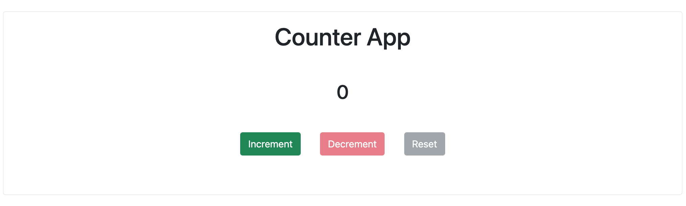

# React Counter App
A simple but yet useful react project. This counter helped me better undersand `useState` and  implemented a `disabled` attribute within a div.

# Link
[Counter App](https://trivera777.github.io/ReactCounter/)

# Preview

# Built With
- HTML
- CSS
- React
- Bootstrap 
